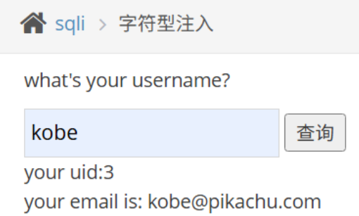
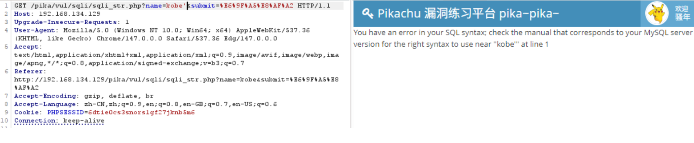
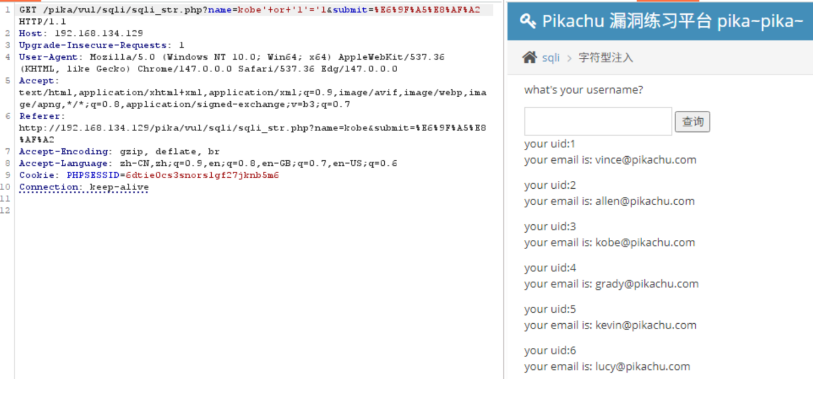

# Pikachu - SQL注入（字符型 GET）

## 一、漏洞类型
SQL Injection（字符型注入）


## 二、实验环境

靶场：Pikachu  
请求方式：GET  


## 三、漏洞原理

后端将用户输入的数据直接拼接到 SQL 语句中，并且使用单引号包裹参数。

开发者未对用户输入进行过滤或参数化处理，导致攻击者可以通过构造特殊字符改变 SQL 原有逻辑。


## 四、如何判断存在字符型注入

### 1. 输入单引号 `'`
由于是GET型，可以直接在URL里修改传入的参数，在参数后加上 ' ，payload：

```sql
kobe'
```
如果返回数据库语法报错，如图



说明：

用户输入进入了 SQL 语句；

后端存在 SQL 拼接；

存在 SQL 注入漏洞。

## 五、字符型注入特点

字符型注入通常：

1、需要先闭合前面的单引号
2、再构造恶意 SQL 语句

字符型注入的后端 SQL 通常类似：

```sql
select * from member where username='kobe'
```

## 六、常见利用方式

构造闭合并让条件恒为真：' or 1=1%23     ' or '1'='1

## SQL 实际拼接效果

payload：

```sql
kobe' or '1'='1
```

后端 SQL 可能变成：

```sql
select * from member where username='kobe' or '1'='1'
```

由于

```sql
'1'='1'
```

 恒成立，因此数据库会返回全部数据。



为什么不用and：username='kobe' and 1=1

虽然 1=1 为真，但当判断到其他用户时，名字对不上，只有 username 为 kobe 的记录满足条件，此时仅返回这一条结果

## 七、测试思路

输入 `'` 后页面出现 SQL 报错，说明用户输入影响了 SQL 语句结构，可能存在 SQL 注入漏洞。

但仅凭 SQL 报错，无法直接判断属于数字型还是字符型注入。

真正的区别在于：

- 数字型注入通常不需要闭合引号

- 字符型注入通常需要先闭合字符串

因此需要进一步通过 payload 测试参数的闭合方式，如 ' or 1=1#

## 八、总结

字符型 SQL 注入的核心特点：

参数通常被单引号包裹

需要先构造引号闭合

常通过 GET 参数触发

攻击者可能：

- 绕过身份验证

- 获取数据库敏感信息

- 修改数据库内容