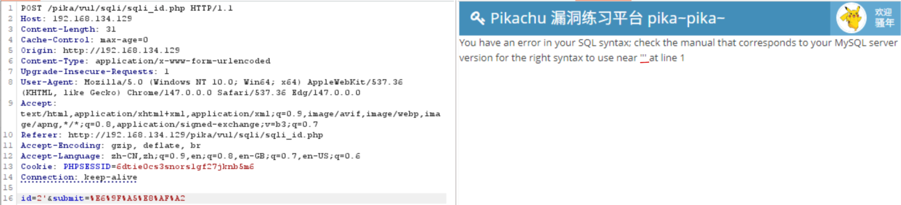
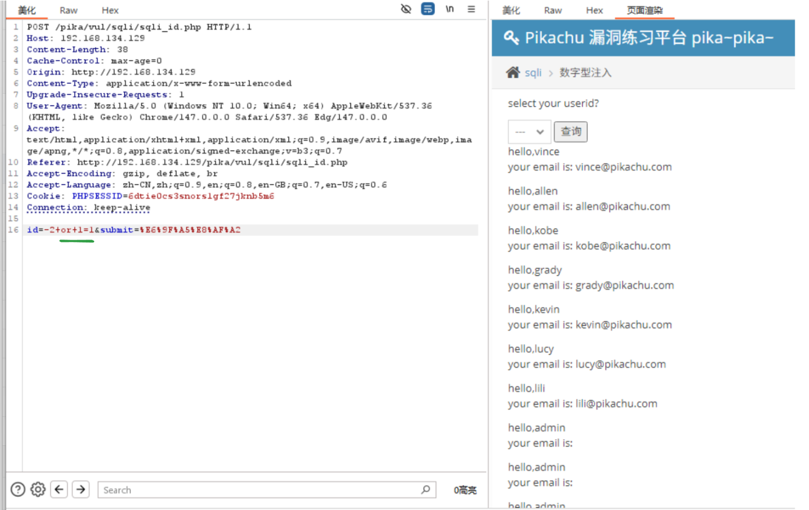

# Pikachu - SQL注入（POST型 - 数字型注入）

##  1. 漏洞位置
Pikachu 靶场中的 SQL Injection → POST 型注入 → 数字型参数

##  2. 请求方式说明
该漏洞通过 POST 请求提交参数，例如：POST /vul/sqli/sqli_post.php HTTP/1.1

参数类似：id=1

##  3. 漏洞原理
后端 SQL 查询语句类似：SELECT * FROM users WHERE id = {user_input};
没有对 id 做过滤或类型限制，导致可以进行 SQL 注入

## 4. 判断是否存在注入
现象：输入',出现数据库语法报错如上图

原因分析：1、' 被直接拼接进 SQL
         2、后端没有使用参数化查询，而是在动态拼接字符串
         3、导致 SQL 语法解析错误（未闭合）

## 5. 数字型注入特点
数字型注入通常：1、不需要引号 ' 来构造闭合 2、直接拼接数字到 SQL 语句中

例如：SELECT * FROM users WHERE id = 1 and 1=1;

## 6. 常见利用方式
判断回显
1 and 1=1
1 and 1=2
绕过测试
-1 or 1=1（使 id=-1 不存在而`1=1` 恒成立，WHERE 条件始终为真，返回所有数据记录。如下图所示）

信息获取（示例）
1 and database()

## 7. 测试思路总结
找参数（POST：id）
判断是否拼接 SQL
测试逻辑真假（and 1=1 / 1=2）
确认注入类型（数字型 or 字符型）

## 8. 总结

该漏洞的核心原因：
后端未使用参数化查询（Prepared Statement）
用户输入直接拼接进 SQL 语句
导致攻击者可以控制 SQL 逻辑结构